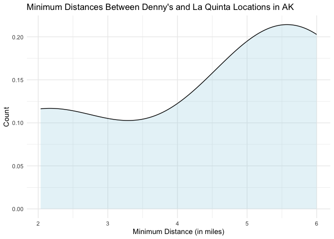

Lab 05 - La Quinta is Spanish for next to Denny’s, Pt. 2
================
Sophie Boyd
2-13-26

### Load packages and data

``` r
library(tidyverse) 
library(dsbox) 
```

``` r
states <- read_csv("data/states.csv")
```

### Exercise 1

``` r
dn_ak <- dennys %>%
  filter(state == "AK")
nrow(dn_ak)
```

    ## [1] 3

There are three Denny’s locations in Alaska.

``` r
lq_ak <- laquinta %>%
  filter(state == "AK")
nrow(lq_ak)
```

    ## [1] 2

There are two La Quinta locations in Alaska.

### Exercise 2

``` r
nrow(dn_ak) * nrow(lq_ak)
```

    ## [1] 6

We need to calculate 6 distances to cover all possible combinations of
Denny’s and La Quinta locations in Alaska.

### Exercise 3

``` r
dn_lq_ak <- full_join(dn_ak, lq_ak,
  by = "state"
)
```

    ## Warning in full_join(dn_ak, lq_ak, by = "state"): Detected an unexpected many-to-many relationship between `x` and `y`.
    ## ℹ Row 1 of `x` matches multiple rows in `y`.
    ## ℹ Row 1 of `y` matches multiple rows in `x`.
    ## ℹ If a many-to-many relationship is expected, set `relationship =
    ##   "many-to-many"` to silence this warning.

``` r
dn_lq_ak
```

    ## # A tibble: 6 × 11
    ##   address.x     city.x state zip.x longitude.x latitude.x address.y city.y zip.y
    ##   <chr>         <chr>  <chr> <chr>       <dbl>      <dbl> <chr>     <chr>  <chr>
    ## 1 2900 Denali   Ancho… AK    99503       -150.       61.2 3501 Min… "\nAn… 99503
    ## 2 2900 Denali   Ancho… AK    99503       -150.       61.2 4920 Dal… "\nFa… 99709
    ## 3 3850 Debarr … Ancho… AK    99508       -150.       61.2 3501 Min… "\nAn… 99503
    ## 4 3850 Debarr … Ancho… AK    99508       -150.       61.2 4920 Dal… "\nFa… 99709
    ## 5 1929 Airport… Fairb… AK    99701       -148.       64.8 3501 Min… "\nAn… 99503
    ## 6 1929 Airport… Fairb… AK    99701       -148.       64.8 4920 Dal… "\nFa… 99709
    ## # ℹ 2 more variables: longitude.y <dbl>, latitude.y <dbl>

### Exercise 4

There are six observations in the joined data frame. The names of the
variables are address, city, state, zip, longitude, latitude, address,
city, zip, each with a version followed by .x and .y (with the exception
of state).

### Exercise 5

To add a new variable to a data frame while keeping the existing
variables, we use the mutate function.

``` r
haversine <- function(long1, lat1, long2, lat2, round = 3) {
  # convert to radians
  long1 <- long1 * pi / 180
  lat1 <- lat1 * pi / 180
  long2 <- long2 * pi / 180
  lat2 <- lat2 * pi / 180

  R <- 6371 # Earth mean radius in km

  a <- sin((lat2 - lat1) / 2)^2 + cos(lat1) * cos(lat2) * sin((long2 - long1) / 2)^2
  d <- R * 2 * asin(sqrt(a))

  return(round(d, round)) # distance in km
}
```

### Exercise 6

``` r
dn_lq_ak <- dn_lq_ak %>%
  mutate(distance = haversine(longitude.x, latitude.x, longitude.y, latitude.y, round = 3))
```

### Exercise 7

``` r
dn_lq_ak <- dn_lq_ak %>%
  group_by(address.x) %>%
  mutate(min_distance = min(distance)) %>%
  ungroup()
```

### Exercise 8

``` r
ggplot(data = dn_lq_ak, aes(x = min_distance)) +
  geom_density(fill = "lightblue", alpha = 0.3) +
  labs(title = "Minimum Distances Between Denny's and La Quinta Locations in Alaska",
       x = "Minimum Distance From La Quinta (in miles)",
       y = "Count",
       ) +
  theme_minimal() +
  scale_fill_viridis_d()
```

<!-- -->

One Denny’s location in Alaska is especially close to a La Quinta (about
2 miles), while the other 2 Denny’s locations are between 5 and 6 miles
away from a La Quinta. There are very few values in the distribution,
but I would tentatively describe this as left-skewed.

##### Descriptives:

``` r
mean(dn_lq_ak$min_distance)
```

    ## [1] 4.41

``` r
min(dn_lq_ak$min_distance)
```

    ## [1] 2.035

``` r
max(dn_lq_ak$min_distance)
```

    ## [1] 5.998
