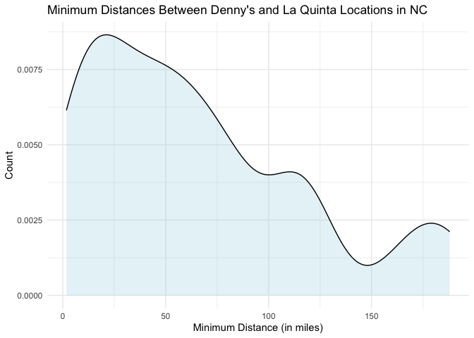

Lab 05 - La Quinta is Spanish for next to Denny’s, Pt. 2
================
Sophie Boyd
2-13-26

### Load packages and data

``` r
library(tidyverse) 
library(dsbox) 
```

``` r
states <- read_csv("data/states.csv")
```

### Exercise 1

``` r
dn_ak <- dennys %>%
  filter(state == "AK")
nrow(dn_ak)
```

    ## [1] 3

There are three Denny’s locations in Alaska.

``` r
lq_ak <- laquinta %>%
  filter(state == "AK")
nrow(lq_ak)
```

    ## [1] 2

There are two La Quinta locations in Alaska.

### Exercise 2

``` r
nrow(dn_ak) * nrow(lq_ak)
```

    ## [1] 6

We need to calculate 6 distances to cover all possible combinations of
Denny’s and La Quinta locations in Alaska.

### Exercise 3

``` r
dn_lq_ak <- full_join(dn_ak, lq_ak,
  by = "state"
)
```

    ## Warning in full_join(dn_ak, lq_ak, by = "state"): Detected an unexpected many-to-many relationship between `x` and `y`.
    ## ℹ Row 1 of `x` matches multiple rows in `y`.
    ## ℹ Row 1 of `y` matches multiple rows in `x`.
    ## ℹ If a many-to-many relationship is expected, set `relationship =
    ##   "many-to-many"` to silence this warning.

``` r
dn_lq_ak
```

    ## # A tibble: 6 × 11
    ##   address.x     city.x state zip.x longitude.x latitude.x address.y city.y zip.y
    ##   <chr>         <chr>  <chr> <chr>       <dbl>      <dbl> <chr>     <chr>  <chr>
    ## 1 2900 Denali   Ancho… AK    99503       -150.       61.2 3501 Min… "\nAn… 99503
    ## 2 2900 Denali   Ancho… AK    99503       -150.       61.2 4920 Dal… "\nFa… 99709
    ## 3 3850 Debarr … Ancho… AK    99508       -150.       61.2 3501 Min… "\nAn… 99503
    ## 4 3850 Debarr … Ancho… AK    99508       -150.       61.2 4920 Dal… "\nFa… 99709
    ## 5 1929 Airport… Fairb… AK    99701       -148.       64.8 3501 Min… "\nAn… 99503
    ## 6 1929 Airport… Fairb… AK    99701       -148.       64.8 4920 Dal… "\nFa… 99709
    ## # ℹ 2 more variables: longitude.y <dbl>, latitude.y <dbl>

### Exercise 4

There are six observations in the joined data frame. The names of the
variables are address, city, state, zip, longitude, latitude, address,
city, zip, each with a version followed by .x and .y (with the exception
of state).

### Exercise 5

To add a new variable to a data frame while keeping the existing
variables, we use the mutate function.

``` r
haversine <- function(long1, lat1, long2, lat2, round = 3) {
  # convert to radians
  long1 <- long1 * pi / 180
  lat1 <- lat1 * pi / 180
  long2 <- long2 * pi / 180
  lat2 <- lat2 * pi / 180

  R <- 6371 # Earth mean radius in km

  a <- sin((lat2 - lat1) / 2)^2 + cos(lat1) * cos(lat2) * sin((long2 - long1) / 2)^2
  d <- R * 2 * asin(sqrt(a))

  return(round(d, round)) # distance in km
}
```

### Exercise 6

``` r
dn_lq_ak <- dn_lq_ak %>%
  mutate(distance = haversine(longitude.x, latitude.x, longitude.y, latitude.y, round = 3))
```

### Exercise 7

``` r
dn_lq_ak <- dn_lq_ak %>%
  group_by(address.x) %>%
  mutate(min_distance = min(distance)) %>%
  ungroup()
```

### Exercise 8

``` r
ggplot(data = dn_lq_ak, aes(x = min_distance)) +
  geom_density(fill = "lightblue", alpha = 0.3) +
  labs(title = "Minimum Distances Between Denny's and La Quinta Locations in AK",
       x = "Minimum Distance From La Quinta (in miles)",
       y = "Count",
       ) +
  theme_minimal() 
```

<!-- -->

##### Descriptives:

``` r
mean(dn_lq_ak$min_distance)
```

    ## [1] 4.41

``` r
median(dn_lq_ak$min_distance)
```

    ## [1] 5.197

``` r
min(dn_lq_ak$min_distance)
```

    ## [1] 2.035

``` r
max(dn_lq_ak$min_distance)
```

    ## [1] 5.998

One Denny’s location in Alaska is especially close to a La Quinta (about
2 miles), while the other 2 Denny’s locations are between 5 and 6 miles
away from a La Quinta. There are very few values in the distribution,
but I would tentatively describe this as left-skewed.

### Exercise 9

#### Filtering Denny’s and La Quinta data frames for NC:

``` r
dn_nc <- dennys %>%
  filter(state == "NC")
nrow(dn_nc)
```

    ## [1] 28

``` r
lq_nc <- laquinta %>%
  filter(state == "NC")
nrow(lq_nc)
```

    ## [1] 12

There are 28 Denny’s locations and 12 La Quinta locations in North
Carolina.

#### Joining the data frames to get a list of all possible pairings:

``` r
dn_lq_nc <- full_join(dn_nc, lq_nc,
  by = "state"
)
```

    ## Warning in full_join(dn_nc, lq_nc, by = "state"): Detected an unexpected many-to-many relationship between `x` and `y`.
    ## ℹ Row 1 of `x` matches multiple rows in `y`.
    ## ℹ Row 1 of `y` matches multiple rows in `x`.
    ## ℹ If a many-to-many relationship is expected, set `relationship =
    ##   "many-to-many"` to silence this warning.

``` r
dn_lq_nc
```

    ## # A tibble: 336 × 11
    ##    address.x    city.x state zip.x longitude.x latitude.x address.y city.y zip.y
    ##    <chr>        <chr>  <chr> <chr>       <dbl>      <dbl> <chr>     <chr>  <chr>
    ##  1 1 Regent Pa… Ashev… NC    28806       -82.6       35.6 165 Hwy … "\nBo… 28607
    ##  2 1 Regent Pa… Ashev… NC    28806       -82.6       35.6 3127 Slo… "\nCh… 28208
    ##  3 1 Regent Pa… Ashev… NC    28806       -82.6       35.6 4900 Sou… "\nCh… 28217
    ##  4 1 Regent Pa… Ashev… NC    28806       -82.6       35.6 4414 Dur… "\nDu… 27707
    ##  5 1 Regent Pa… Ashev… NC    28806       -82.6       35.6 1910 Wes… "\nDu… 27713
    ##  6 1 Regent Pa… Ashev… NC    28806       -82.6       35.6 1201 Lan… "\nGr… 27407
    ##  7 1 Regent Pa… Ashev… NC    28806       -82.6       35.6 1607 Fai… "\nCo… 28613
    ##  8 1 Regent Pa… Ashev… NC    28806       -82.6       35.6 191 Cres… "\nCa… 27518
    ##  9 1 Regent Pa… Ashev… NC    28806       -82.6       35.6 2211 Sum… "\nRa… 27612
    ## 10 1 Regent Pa… Ashev… NC    28806       -82.6       35.6 1001 Aer… "\nMo… 27560
    ## # ℹ 326 more rows
    ## # ℹ 2 more variables: longitude.y <dbl>, latitude.y <dbl>

#### Calculating the distances between the pairings:

``` r
dn_lq_nc <- dn_lq_nc %>%
  mutate(distance = haversine(longitude.x, latitude.x, longitude.y, latitude.y, round = 3))
```

#### Calculating the minimum distance between each Denny’s and La Quinta location:

``` r
dn_lq_nc <- dn_lq_nc %>%
  group_by(address.x) %>%
  mutate(min_distance = min(distance)) %>%
  ungroup()
```

#### Visualizing and summarizing:

``` r
ggplot(data = dn_lq_nc, aes(x = min_distance)) +
  geom_density(fill = "lightblue", alpha = 0.3) +
  labs(title = "Minimum Distances Between Denny's and La Quinta Locations in NC",
       x = "Minimum Distance From La Quinta (in miles)",
       y = "Count",
       ) +
  theme_minimal() 
```

<!-- -->

##### Descriptives:

``` r
mean(dn_lq_nc$min_distance)
```

    ## [1] 65.44432

``` r
median(dn_lq_nc$min_distance)
```

    ## [1] 53.4565

``` r
min(dn_lq_nc$min_distance)
```

    ## [1] 1.779

``` r
max(dn_lq_nc$min_distance)
```

    ## [1] 187.935

The distribution of minimum distances from La Quinta is skewed right for
North Carolina. The distribution of minimum distances is centered around
50-60 miles, but the highest minimum distance is 187.94 miles.

### Exercise 10

#### Filtering Denny’s and La Quinta data frames for TX:

``` r
dn_tx <- dennys %>%
  filter(state == "TX")
nrow(dn_tx)
```

    ## [1] 200

``` r
lq_tx <- laquinta %>%
  filter(state == "TX")
nrow(lq_tx)
```

    ## [1] 237

There are 200 Denny’s locations and 237 La Quinta locations in Texas.

#### Joining the data frames to get a list of all possible pairings:

``` r
dn_lq_tx <- full_join(dn_tx, lq_tx,
  by = "state"
)
```

    ## Warning in full_join(dn_tx, lq_tx, by = "state"): Detected an unexpected many-to-many relationship between `x` and `y`.
    ## ℹ Row 1 of `x` matches multiple rows in `y`.
    ## ℹ Row 1 of `y` matches multiple rows in `x`.
    ## ℹ If a many-to-many relationship is expected, set `relationship =
    ##   "many-to-many"` to silence this warning.

``` r
dn_lq_tx
```

    ## # A tibble: 47,400 × 11
    ##    address.x    city.x state zip.x longitude.x latitude.x address.y city.y zip.y
    ##    <chr>        <chr>  <chr> <chr>       <dbl>      <dbl> <chr>     <chr>  <chr>
    ##  1 120 East I-… Abile… TX    79601       -99.6       32.4 3018 Cat… "\nAb… 79606
    ##  2 120 East I-… Abile… TX    79601       -99.6       32.4 3501 Wes… "\nAb… 79601
    ##  3 120 East I-… Abile… TX    79601       -99.6       32.4 14925 La… "\nAd… 75254
    ##  4 120 East I-… Abile… TX    79601       -99.6       32.4 909 East… "\nAl… 78516
    ##  5 120 East I-… Abile… TX    79601       -99.6       32.4 2400 Eas… "\nAl… 78332
    ##  6 120 East I-… Abile… TX    79601       -99.6       32.4 1220 Nor… "\nAl… 75013
    ##  7 120 East I-… Abile… TX    79601       -99.6       32.4 1165 Hwy… "\nAl… 76009
    ##  8 120 East I-… Abile… TX    79601       -99.6       32.4 880 Sout… "\nAl… 77511
    ##  9 120 East I-… Abile… TX    79601       -99.6       32.4 1708 Int… "\nAm… 79103
    ## 10 120 East I-… Abile… TX    79601       -99.6       32.4 9305 Eas… "\nAm… 79118
    ## # ℹ 47,390 more rows
    ## # ℹ 2 more variables: longitude.y <dbl>, latitude.y <dbl>

#### Calculating the distances between the pairings:

``` r
dn_lq_tx <- dn_lq_tx %>%
  mutate(distance = haversine(longitude.x, latitude.x, longitude.y, latitude.y, round = 3))
```

#### Calculating the minimum distance between each Denny’s and La Quinta location:

``` r
dn_lq_tx <- dn_lq_tx %>%
  group_by(address.x) %>%
  mutate(min_distance = min(distance)) %>%
  ungroup()
```

#### Visualizing and summarizing:

``` r
ggplot(data = dn_lq_tx, aes(x = min_distance)) +
  geom_density(fill = "lightblue", alpha = 0.3) +
  labs(title = "Minimum Distances Between Denny's and La Quinta Locations in TX",
       x = "Minimum Distance From La Quinta (in miles)",
       y = "Count",
       ) +
  theme_minimal() 
```

<!-- -->

##### Descriptives:

``` r
mean(dn_lq_tx$min_distance)
```

    ## [1] 5.7918

``` r
median(dn_lq_tx$min_distance)
```

    ## [1] 3.3715

``` r
min(dn_lq_tx$min_distance)
```

    ## [1] 0.016

``` r
max(dn_lq_tx$min_distance)
```

    ## [1] 60.582

The distribution of minimum distances for Texas is very right-skewed.
Most of the minimum distances are quite low (between 3 and 6 miles), but
the highest minimum distance is 60.58 miles.

### Exercise 11 (state of choice: Arizona)

#### Filtering Denny’s and La Quinta data frames for AZ:

``` r
dn_az <- dennys %>%
  filter(state == "AZ")
nrow(dn_az)
```

    ## [1] 83

``` r
lq_az <- laquinta %>%
  filter(state == "AZ")
nrow(lq_az)
```

    ## [1] 18

There are 83 Denny’s locations and 18 La Quinta locations in Arizona.

#### Joining the data frames to get a list of all possible pairings:

``` r
dn_lq_az <- full_join(dn_az, lq_az,
  by = "state"
)
```

    ## Warning in full_join(dn_az, lq_az, by = "state"): Detected an unexpected many-to-many relationship between `x` and `y`.
    ## ℹ Row 1 of `x` matches multiple rows in `y`.
    ## ℹ Row 1 of `y` matches multiple rows in `x`.
    ## ℹ If a many-to-many relationship is expected, set `relationship =
    ##   "many-to-many"` to silence this warning.

``` r
dn_lq_az
```

    ## # A tibble: 1,494 × 11
    ##    address.x    city.x state zip.x longitude.x latitude.x address.y city.y zip.y
    ##    <chr>        <chr>  <chr> <chr>       <dbl>      <dbl> <chr>     <chr>  <chr>
    ##  1 4121 W Anth… Anthem AZ    85086       -112.       33.9 "2015 So… "\nFl… 86001
    ##  2 4121 W Anth… Anthem AZ    85086       -112.       33.9 "3419 Ho… "\nKi… 86409
    ##  3 4121 W Anth… Anthem AZ    85086       -112.       33.9 "70 Kaib… "\nPa… 86040
    ##  4 4121 W Anth… Anthem AZ    85086       -112.       33.9 "6530 Ea… "\nMe… 85206
    ##  5 4121 W Anth… Anthem AZ    85086       -112.       33.9 "6020 We… "\nTu… 85743
    ##  6 4121 W Anth… Anthem AZ    85086       -112.       33.9 "15241 S… "\nPh… 85044
    ##  7 4121 W Anth… Anthem AZ    85086       -112.       33.9 "4929 We… "\nPh… 85035
    ##  8 4121 W Anth… Anthem AZ    85086       -112.       33.9 "902 Wes… "\nMe… 85210
    ##  9 4121 W Anth… Anthem AZ    85086       -112.       33.9 "2510 W … "\nPh… 85023
    ## 10 4121 W Anth… Anthem AZ    85086       -112.       33.9 "8888 Ea… "\nSc… 85260
    ## # ℹ 1,484 more rows
    ## # ℹ 2 more variables: longitude.y <dbl>, latitude.y <dbl>

#### Calculating the distances between the pairings:

``` r
dn_lq_az <- dn_lq_az %>%
  mutate(distance = haversine(longitude.x, latitude.x, longitude.y, latitude.y, round = 3))
```

#### Calculating the minimum distance between each Denny’s and La Quinta location:

``` r
dn_lq_az <- dn_lq_az %>%
  group_by(address.x) %>%
  mutate(min_distance = min(distance)) %>%
  ungroup()
```

#### Visualizing and summarizing:

``` r
ggplot(data = dn_lq_az, aes(x = min_distance)) +
  geom_density(fill = "lightblue", alpha = 0.3) +
  labs(title = "Minimum Distances Between Denny's and La Quinta Locations in AZ",
       x = "Minimum Distance From La Quinta (in miles)",
       y = "Count",
       ) +
  theme_minimal() 
```

<!-- -->

##### Descriptives:

``` r
mean(dn_lq_az$min_distance)
```

    ## [1] 36.93565

``` r
median(dn_lq_az$min_distance)
```

    ## [1] 7.946

``` r
min(dn_lq_az$min_distance)
```

    ## [1] 0.021

``` r
max(dn_lq_az$min_distance)
```

    ## [1] 242.734

The distribution of minimum distances is also right-skewed for Arizona.
The median minimum distance from a Denny’s to a La Quinta is 7.95 miles,
but the mean minimum distance is 36.94 miles and the highest minimum
distance is 242.73 miles.
